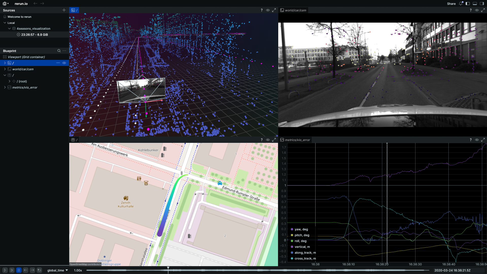

# rerun-4seasons

A Rust CLI program to visualize the [4Seasons](https://cvg.cit.tum.de/data/datasets/4seasons-dataset) SLAM dataset.



## The dataset

You can find a decent description of the dataset in [this repository](https://github.com/pmwenzel/4seasons-dataset).
Here are some more insights and details how this dataset is used in this visualization:

1. To run the visualization you need to download and unzip the following archives from the [download page](https://cvg.cit.tum.de/data/datasets/4seasons-dataset/download): "Point clouds", "Reference poses", "Stereo images (undistorted)".
   After unzipping the directory content should look as follows:
   ```
   .
   ├── GNSSPoses.txt
   ├── KeyFrameData
   ├── times.txt
   ├── Transformations.txt
   └── undistorted_images
   ```
2. There are two 6DoF trajectories provided - a ground truth (GT) trajectory and a visual-inertial odometry (VIO) trajectory. 
   The GT trajectory is contained in GNSSPoses.txt, whereas the VIO trajectory is contained in KeyFrameData directory files and result.txt.
   The important thing is that without any additional transformations _both_ trajectories provide camera poses relative to same SLAM/VIO frame of reference.
   To get metric poses relative to ECEF you need to apply the chain of transforms described [here](https://github.com/pmwenzel/4seasons-dataset).
3. To get point clouds you need to take pixel coordinates and inverse depths of tracked points from KeyFrameData files and project them into the world.
   There are two ways to do that:
      1. Using GT poses -- this will create a globally consistent point cloud with a caveat that provided point depths are not optimized, which can create some inconsistencies.
      2. Using VIO poses -- this will create a point cloud consistent within some time window and also with images and 2D key points on them.
   The visualization provides both, with VIO cloud displayed in a vicinity of current position.
4. The IMU axes are rotated from the car axes by 180 degrees around the vertical axis. 
   While the dataset doesn't use or mention the car frame, I do it for the visualization and interpretation purposes by introducing car entity and `car -> IMU -> camera` transform chain.

## The visualization

The screenshot at the beginning show a rerun window with the open visualization on "office_loop_1_train" sequence.
There are 4 views:

1. The 3D view showing local point cloud with gradient coloring based on point z-coordinate (height).
   The global point cloud view is available (in constant color), but toggled off for better visual clarity.
2. The image view with tracked key points with gradient coloring based on point depth.
   The left (cam0) camera images are used for the visualization.
3. The map view showing a current position and a recent track.
4. The plot view showing time series of VIO pose errors with respect to ground truth poses.

Some tips and tricks for using the visualization:

1. You can configure rerun viewer as you see fit.
2. There is an entity called "observation_point". 
   It is convenient to select it by "Set as eye tracked", zoom in appropriately and observe the surrounding as the vehicle moves.
3. The blueprint file for the 4-panel view shown above is provided in the repository.

## Build and run

The code was developed and tested in Ubuntu 20.04 with:
```bash
rustc 1.93.1
rerun-cli 0.30.1
```
As far as I understand, all dependencies and versions should be handled by `Cargo.toml` and `Cargo.lock`.
To build, run using cargo and see the result in rerun, execute:
```bash
cargo run --release -- /path/to/sequence [result.rrd]
rerun result.rrd blueprint.rbl
```

## Acknowledgements

This project uses the [4Seasons dataset](https://cvg.cit.tum.de/data/datasets/4seasons-dataset). 
If you use this visualization with the dataset, please cite the original paper:
```bibtex
@inproceedings{wenzel2020fourseasons,
  author = {P. Wenzel and R. Wang and N. Yang and Q. Cheng and Q. Khan and 
  L. von Stumberg and N. Zeller and D. Cremers},
  title = {{4Seasons}: A Cross-Season Dataset for Multi-Weather {SLAM} in Autonomous Driving},
  booktitle = {Proceedings of the German Conference on Pattern Recognition ({GCPR})},
  year = {2020}
}
```
